# SCM (GitHub) Project:

---

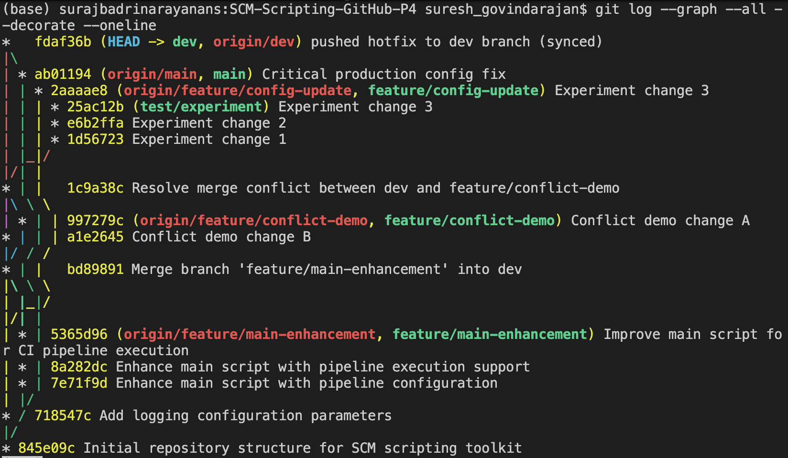

#### Step 1 - Creating Project Folder Structure:

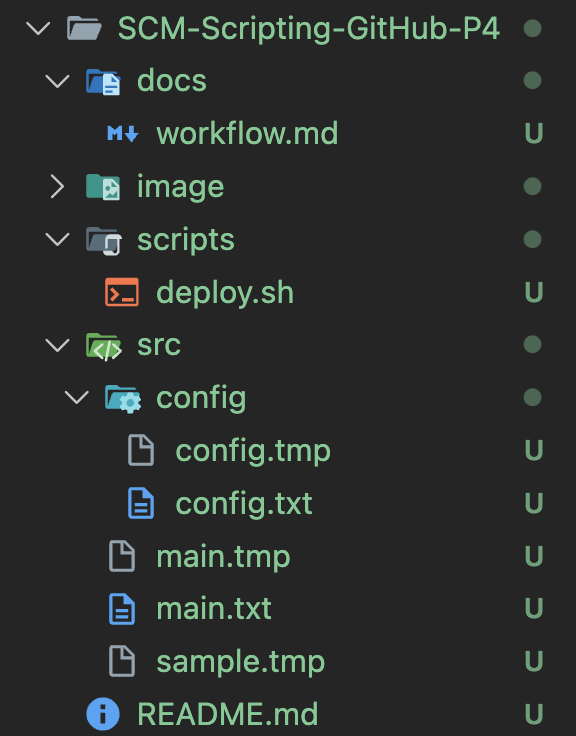

Adding sample contents to all the files.

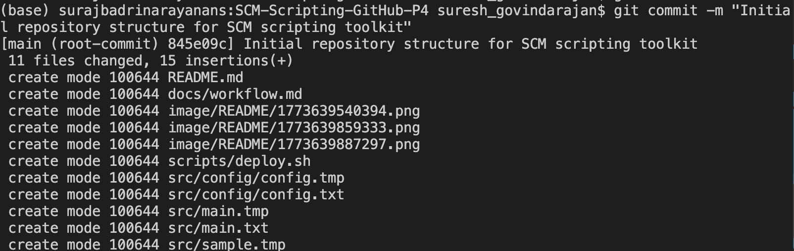

Adding all the files to staging area, committing them and pushing it to GitHub for the inital project folder setup.

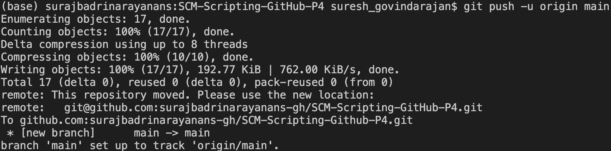

Pushing the contents to the GitHub repository.

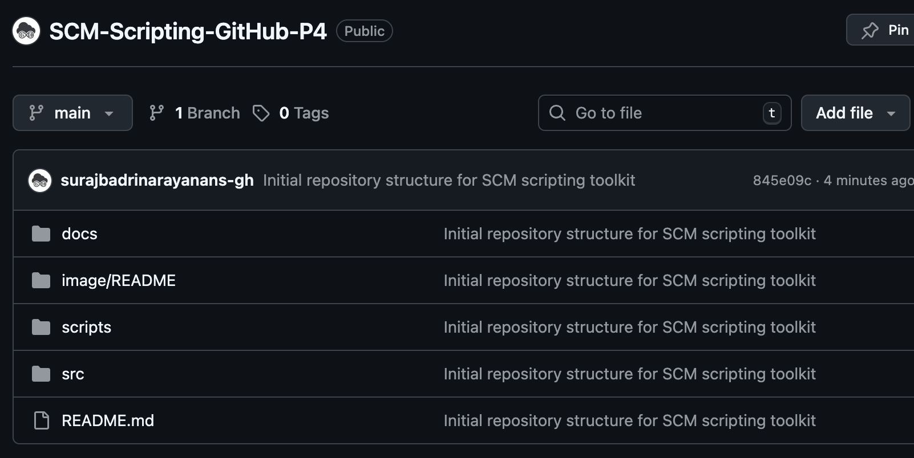

---

#### Step 2 - Creating Development Workflow:

- main → production
- dev  → integration branch
- feature branches → development work

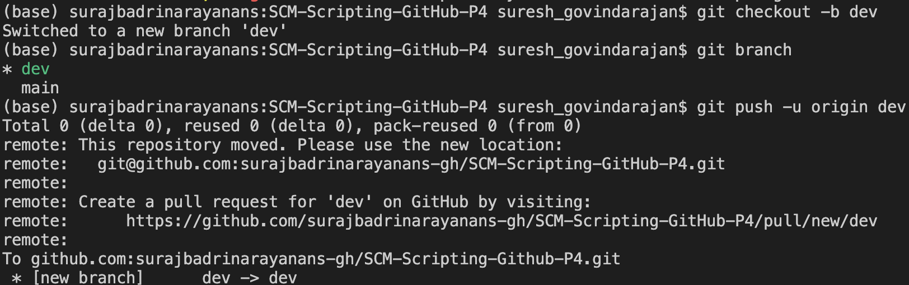

Creating a dev branch and pushing the code contents and folders to the dev branch.

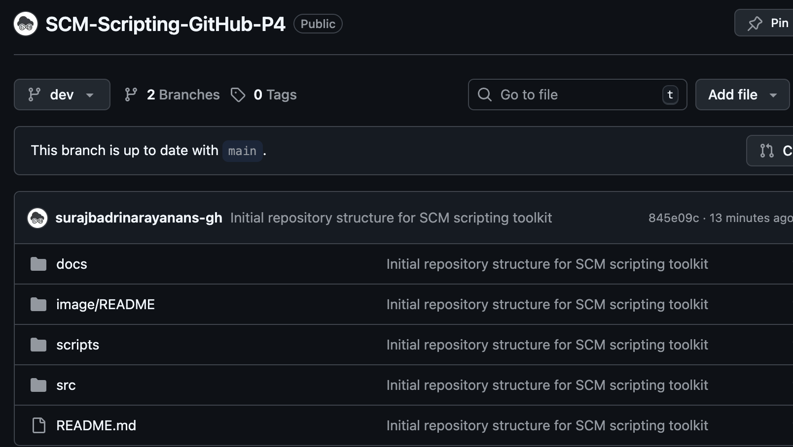

---

#### Step 3 - Simulating the Feature Development:

Situation:

There are 2 developers A and B. they will be working on separate feature branches.

For developer A:

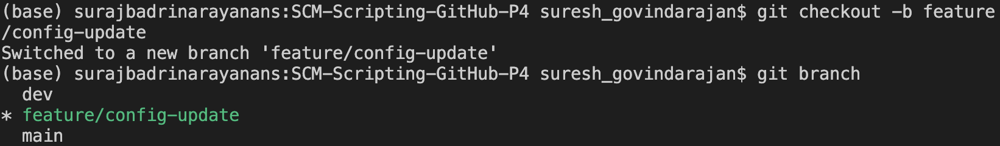

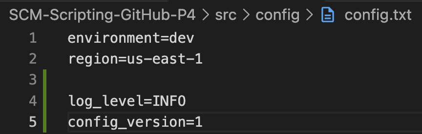

Modifying the configuration file.

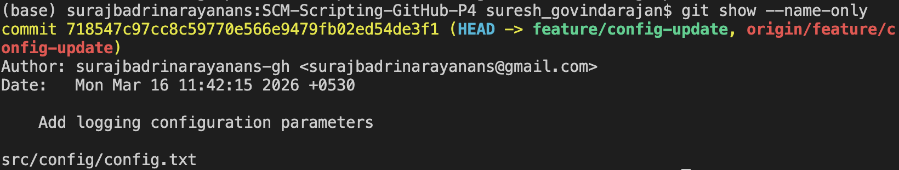

Adding, commiting and pushing only that configuration file.

Even though the entire folder structure appears in the feature branch (because of the initial git add. for the project folder structure initialisation) the feature-branch only containes the config file commit snapshot.

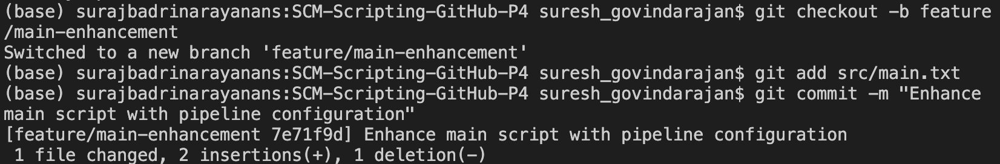

Checking out to a new feature branch to Developer B.

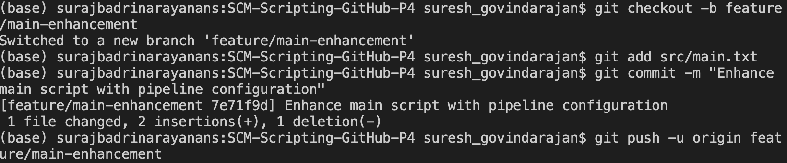

Adding, committing and pushing changes to the main folder feature branch.

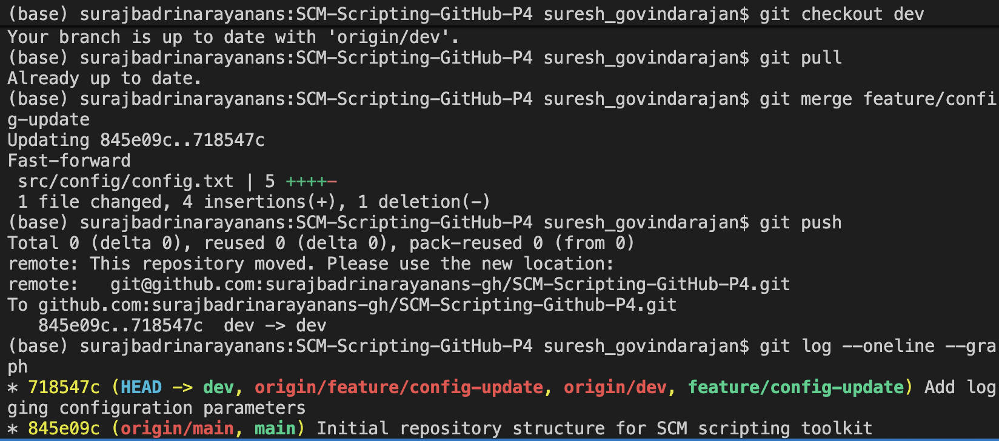

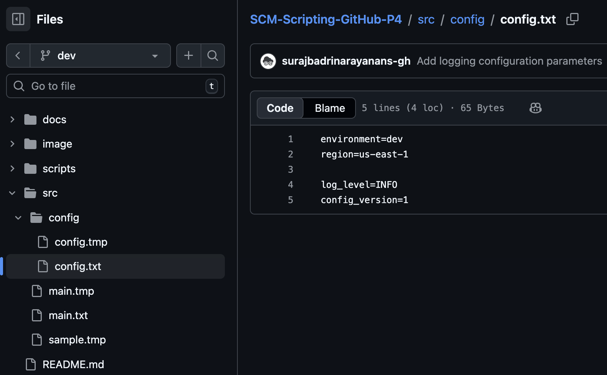

After merging the changes of the configuration feature branch the dev branch is now updated with that feature.

---

#### Step 4 - Second Feature Development (Merge Conflict):

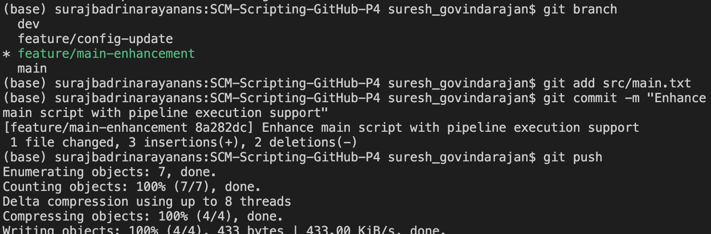

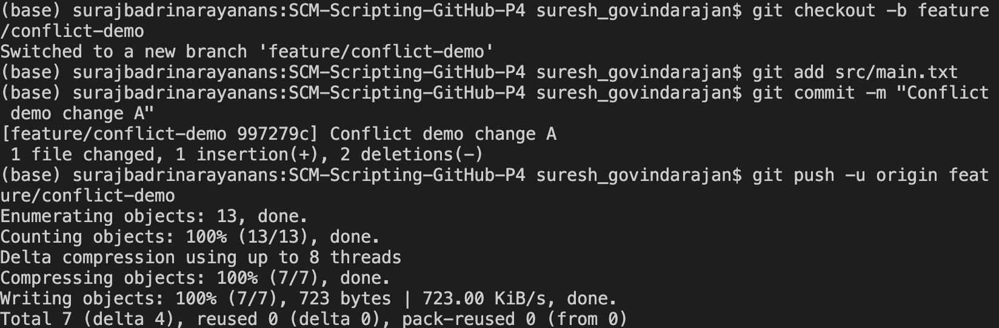

Creating a feature branch to demonstrate merge conflicts.

- A new feature branch modified the main.txt file.
- A developer in the dev branch also modified the same file.
- Both tried to modify the same file before merging so the conflict occured.

What should have done actually?

- A new feature must be merged to the dev branch first.
- The dev branch must be pulled and should be made upto date.
- Then the other developer should enhance the file again, push it and merge it so that the conflict does not happen.

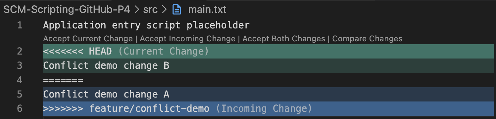

---

#### Step 5 - Cherry Picking:

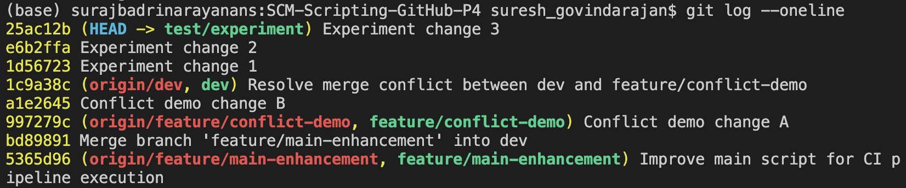

Consider the test feature branch with 3 experimental commits.

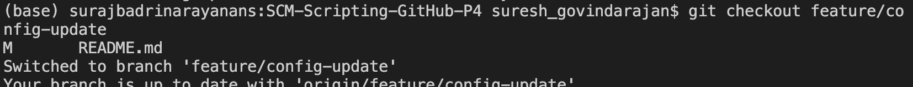

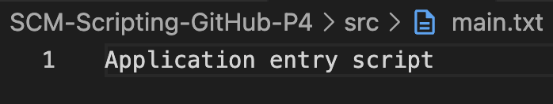

Switching to the config branch and seeing the contents of the main.txt file.

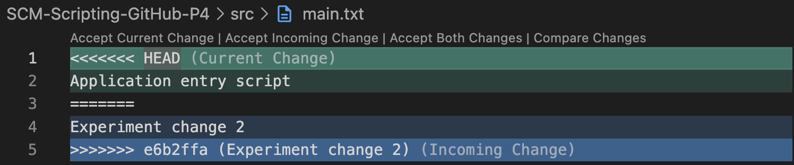

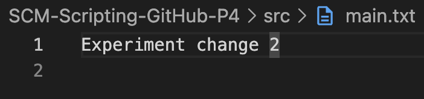

---

#### Step 6 - Hotfix:

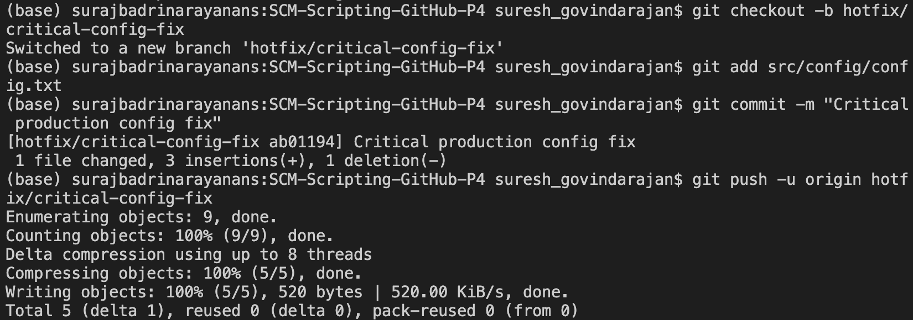

Creating a hotfix branch and pushing the hotfix to the hotfix branch.

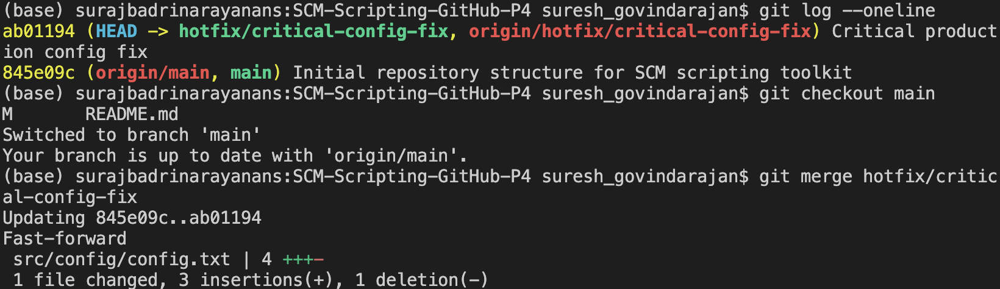

Merging the branch again to main so that the hotfix feature is reflected in the main branch.

Now the main branch only contains the changes of the hotfix branch and not the dev branch so we need to sync the hotfix to dev branch also.

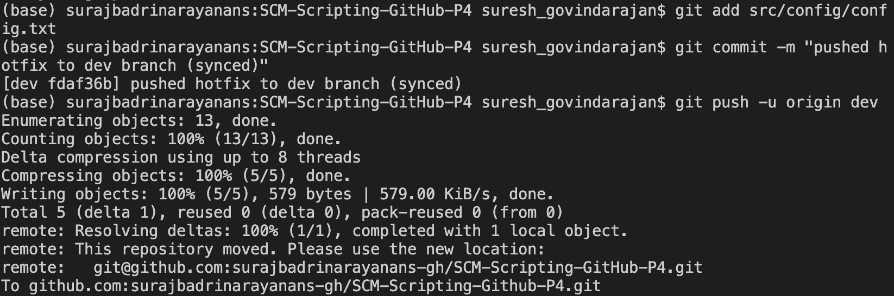

Once the production is stable, we delete the hotfix branch locally and remotely.

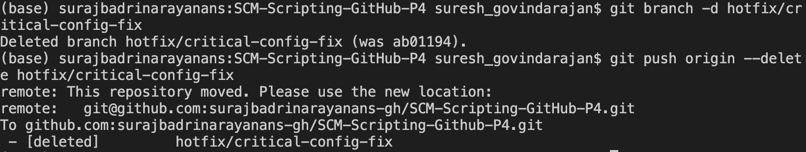

---
